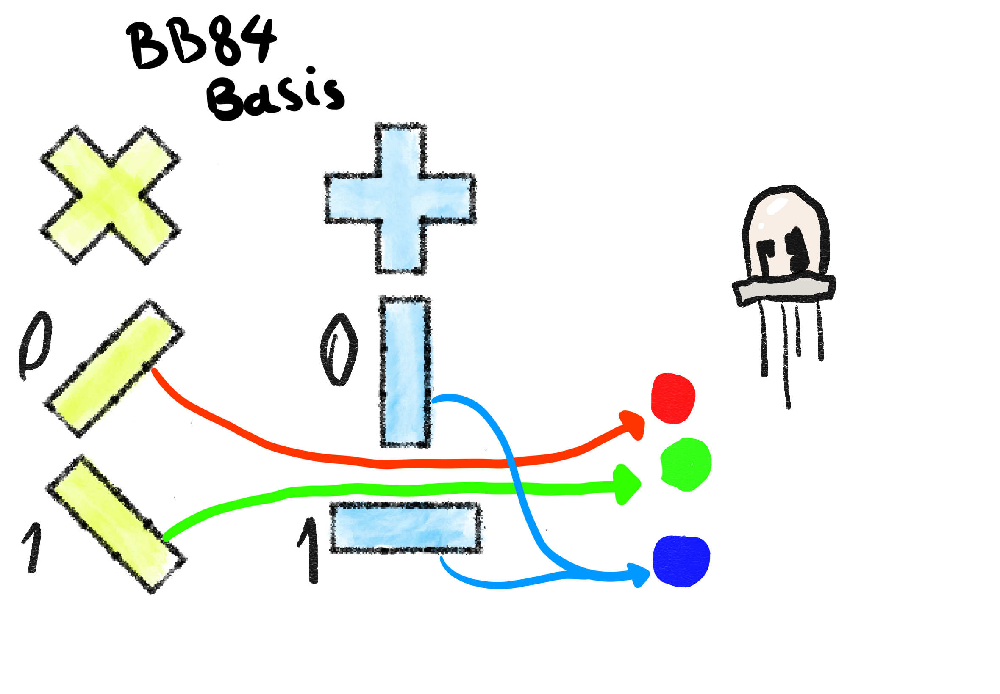

# QuPiNet - QKD Simulation and OpenSSL Integration

QuPiNet is a multi-component project designed to simulate the BB84 Quantum Key Distribution (QKD) protocol: Software AND Hardware. 

It features an interactive web interface, a robust Python backend that simulates the QKD nodes according to ETSI GS QKD 004 (used on Raspberry Pi's and personal computers), and a custom C-based OpenSSL engine that uses the generated quantum keys as a high-quality source of entropy.

Our system simulates quantum state transmission by mapping polarization bases (rectilinear and diagonal) to specific RGB LED colors. While the QKD nodes possess complete knowledge of this basis-to-color mapping, external observers cannot determine the bit values (0 or 1) from the observed colors alone, preserving the information-theoretic security fundamental to the BB84 protocol.
## Project Demo




## Credits
The web interface for this project was developed in collaboration with Gabriela Brezeanu, Gabriel Scinteie, Ioana-Cristina Prioteasa, and Delia-Elena Barbuta during the [RoNaQCI Quantum Hackathon 2025 - Team VibeQoders](https://www.ronaqci.eu/hackathon/). Their work on the frontend was instrumental in creating an intuitive and educational user experience.

## Project Architecture

The system is composed of three main parts that work together:

1.  **Node.js Web App**: The user-facing graphical interface (GUI) that allows users to visualize and control the QKD protocol. It communicates with the Python backend.
2.  **Python QKD Network**: Two or more Flask-based Python servers that act as QKD nodes (e.g., Alice and Bob). They implement the BB84 protocol logic and expose a REST API for control.
3.  **OpenSSL Engine**: A custom engine written in C that plugs into OpenSSL. It fetches quantum keys from the Python QKD Network and provides them as a source for OpenSSL's random number generator.

## Prerequisites

Before you begin, ensure you have the following installed:
- **Node.js and npm**
- **Python 3.x and pip**
- **OpenSSL** development libraries
- **libcurl** development libraries
- A C compiler (like **GCC** or **Clang**)
- **Zsh** (for running the engine test script)

---

## How to Run the Node App (Web Interface)

This is the frontend application that you will interact with in your browser.

**1. Navigate to the project directory and install dependencies:**
   ```bash
   npm install
   ```

**2. (Optional) Install `nodemon` globally to restart the app automatically on file changes:**
   ```bash
   npm install -g nodemon
   ```

**3. Start the application:**
   ```bash
   # Using nodemon
   nodemon app.js     
   
   # Or using node
   node app.js       
   ```

**4. Open the app in your browser:**
   [http://localhost:6789/](http://localhost:6789/)

---

## How to Run the Simulated QKD Network (Backend)

This is the core Python backend that simulates the QKD protocol. The web app needs this running to function correctly.

**1. Install Python dependencies:**
   ```bash
   pip install -r requirements.txt
   ```

**2. Start the QKD nodes.** You need to run each node in a **separate terminal window**.

   **Terminal:**
   ```bash
   python qkd_api_node.py --port <port> --peer-host <peer_ip> --peer-port <peer_port> \
--node-type <hardware|gui> --time-between <seconds> \
--key-len <bits> --raw-mult <multiplier>
   ```
   - `--port`: The port number for this QKD node to listen on.
   - `--peer-host`: The IP address or hostname of the peer QKD node.
   - `--peer-port`: The port number of the peer QKD node.
   - `--node-type`: Set to `hardware` for hardware simulation or `gui` to use your personal computer as a node (requires a webcam/a monitor for read/write).
   - `--time-between`: Time interval (in seconds) between colors.
   - `--key-len`: Length of the generated key in bits.
   - `--raw-mult`: Multiplier for the number of raw bits generated per round.

   Now both the web interface and the backend simulation are running. You can use the GUI to initiate a key exchange.

---

## How to Test the System

You can test the components independently to ensure they are working correctly.

### 1. Testing the Python API

This test script runs a full key exchange between the two running nodes and verifies that their final keys match.
Might require modifications based on your devices.

   **In a new, third terminal:**
   ```bash
   python test.py
   ```

### 2. Testing the OpenSSL Engine Integration

This test validates that the C engine can be compiled, loaded by OpenSSL, and used to generate random numbers from the QKD key.

   **Navigate to the engine directory and run the test script:**
   ```bash
   cd engine/qkd/
   ./run_template_engine.zsh
   ```
   This script will automatically compile the engine, configure OpenSSL to use it, request random bytes, and then clean up the temporary files. If it outputs a hex string without errors, the integration is successful.

   Might also require modifications